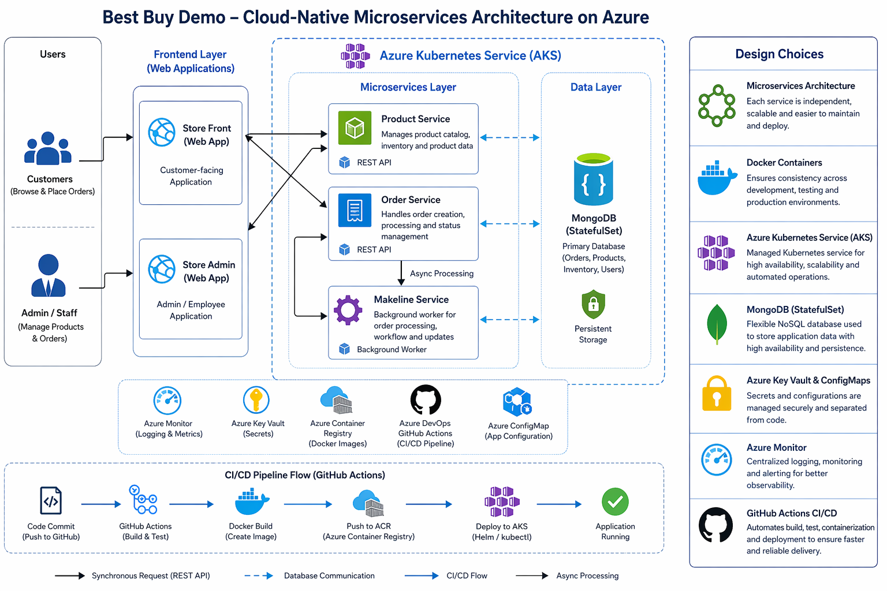

# CST8915: Cloud-Native App for Best Buy

**Student Name**: Xinyi Zhao    
**Student ID**: 040953633    
**Course**: CST8915 Full-stack Cloud-native Development  
**Semester**: Winter 2026   

# 🛒 Cloud-Native Microservices Application (Best Buy Demo)

## 📌 Overview
This project is a cloud-native microservices application developed as part of a Full-Stack Cloud-Native Developer role simulation.

The system is designed using a microservices architecture inspired by the **Algonquin Pet Store (On Steroids)** model.  It demonstrates containerization, Kubernetes deployment, and CI/CD automation using GitHub Actions.

---

## 🏗️ Architecture
### 📎 Architecture Diagram:  


This diagram illustrates the interaction between users, frontend applications, backend services, and the database within an AKS-managed environment.

### Application workflow

```text
👤 Customer        👨‍💼 Admin
     |                  |
     v                  v
🛍️ Store Front     🛠️ Store Admin
        \            /
         \          /
     📦 Product   🧾 Order
                       |
                       v
                 ⚙️ Makeline
                       |
                       v
                 🍃 MongoDB

```
The application consists of **5 microservices and 1 database**:

- **Store-Front** – Customer-facing web application  
- **Store-Admin** – Employee/admin web application  
- **Order-Service** – Handles order processing  
- **Product-Service** – Manages product catalog  
- **Makeline-Service** – Background worker for order processing  
- **MongoDB** – Stateful database  

---

## ⚙️ Design Choices

### 1. Microservices Architecture
A microservices architecture was selected to separate the application into smaller, independent services, each with a focused responsibility. This makes the system easier to develop, test, deploy, and scale. For example, product management, order processing, and background workflow handling are separated into different services, which improves maintainability and reduces coupling between components.

### 2. Store Front and Store Admin Web Applications
Both Store Front and Store Admin are implemented as **server-side rendered web applications** using Node.js, Express.js, and EJS templating.

This approach allows dynamic content to be generated on the server and sent as HTML to the client, simplifying the architecture by avoiding the need for a separate frontend framework.

It is well-suited for this project because:
* It reduces complexity for a microservices demo
* It integrates easily with backend APIs
* It supports fast development and deployment

### 3. Node.js and JavaScript
Node.js with JavaScript was used for all services to provide a consistent and efficient development environment. Since the application is API-driven and lightweight, Node.js is well suited for handling asynchronous operations such as HTTP requests and service communication. 

### 4. Express.js and EJS (Server-Side Rendering)
Express.js was used as the backend framework to build RESTful APIs and web servers for the application.  

For the frontend (Store Front and Store Admin), **EJS (Embedded JavaScript Templates)** was used to render dynamic HTML on the server side. This approach simplifies the application structure and avoids the need for a separate frontend framework, while still supporting dynamic content rendering.

### 5. Background Processing with Makeline Service
The **Makeline Service** was designed as a background worker to process order-related tasks asynchronously. This improves responsiveness in the main order workflow because the Order Service does not need to wait for all processing steps to complete before responding. This design better reflects real cloud-native systems, where background services are commonly used for workflow processing and event-driven tasks.

### 6. MongoDB as the Database
**MongoDB** was selected as the primary database because it is flexible and works well with JSON-like application data. In a microservices-based application, a NoSQL database is a suitable choice for handling changing or loosely structured data such as products and orders. MongoDB was deployed using a **StatefulSet with Persistent Volume Claims (PVCs)** to ensure data persistence even if pods are restarted.

### 7. Docker Containers
Each service was containerized using **Docker** to ensure consistency across development, testing, and deployment environments. Containers package the application code together with its dependencies, which reduces environment-related issues and makes deployments more reliable. This also supports portability between local development and Azure Kubernetes Service.

### 8. Azure Kubernetes Service (AKS)
**AKS** was chosen to orchestrate and manage the containerized microservices. Kubernetes provides features such as service discovery, scaling, rolling updates, and self-healing, which are important for cloud-native applications. AKS simplifies cluster management while still providing the benefits of Kubernetes in a managed Azure environment.

### 9. ConfigMaps and Secrets
**ConfigMaps** and **Secrets** were used to manage configuration values separately from application code. This follows cloud-native best practices by improving security and flexibility. Non-sensitive settings, such as service URLs and ports, are stored in ConfigMaps, while sensitive data, such as database credentials, are stored in Secrets.

### 10. GitHub Actions for CI/CD
**GitHub Actions** was used to implement CI/CD pipelines for each microservice. Each pipeline builds Docker images, pushes them to Docker Hub, and triggers rolling updates in AKS. This supports continuous integration and continuous delivery by automatically building Docker images, pushing them to a container registry, and deploying updated versions to Kubernetes. It improves development efficiency and demonstrates a modern DevOps workflow.

### 11. Azure Container Registry / Docker Hub
A container registry was needed to store and distribute Docker images for deployment. This allows Kubernetes to pull the latest version of each service image during deployment. Using a registry is an essential part of a CI/CD-enabled container workflow.

### 12. Cloud-Native Design Approach
Overall, the project was designed using cloud-native principles, including service isolation, containerization, orchestration, externalized configuration, and automated deployment. These decisions improve scalability, maintainability, and deployment efficiency, while also aligning with modern enterprise application design. 

---

## 🚀 Deployment (Kubernetes)
All services are deployed to **Azure Kubernetes Service (AKS)**.

### Key Configuration:
- **ConfigMaps** → Store environment variables  
- **Secrets** → Store sensitive data (connection strings, credentials)  
- **StatefulSet** → Used for MongoDB (stateful workload)  
- **Services** → Expose microservices internally/externally  

### Deployment Steps:
1. Build Docker images for each service  
2. Push images to Docker Hub  
3. Apply Kubernetes manifests:
```bash
kubectl apply -f deployment-files/[service-name].yaml
```
4. Verify pods and services:
```bash
kubectl get pods
kubectl get services
```
## 🧪 MongoDB Data Verification

To verify that product data is stored persistently in MongoDB, the database was accessed directly from the Kubernetes cluster.

### Steps:
```bash
kubectl exec -it mongodb-0 -- mongosh
```
```javascript
use bestbuy
show collections
db.products.find().pretty()
```

## 🔄 CI/CD Pipeline
Each microservice has its own GitHub Actions pipeline that:
* Builds Docker image
* Pushes to Docker Hub
* Deploys to Kubernetes (AKS)

Pipelines are triggered on code push to the main branch.

## 🔗 Microservices Repositories

### 🛍️ Store Front Service
Frontend application for user interaction and product browsing.  
👉 https://github.com/XinyiZhao-cloud/final-store-front


### 📦 Product Service
Handles product catalogue, inventory, and product-related APIs.  
👉 https://github.com/XinyiZhao-cloud/final-product-service


### 🧾 Order Service
Manages customer orders, order processing, and status tracking.  
👉 https://github.com/XinyiZhao-cloud/final-order-service


### ⚙️ Makeline Service
Handles order workflow, processing logic, and background operations.  
👉 https://github.com/XinyiZhao-cloud/final-makeline-service


### 🛠️ Store Admin Service
Provides administrative controls, monitoring, and management features.  
👉 https://github.com/XinyiZhao-cloud/final-store-admin

### 📁 Deployment Files
All Kubernetes YAML manifests are located in:
 ```
deployment-files/
 ```
 Includes:
* Deployments
* Services
* ConfigMaps
* Secrets
* StatefulSet (MongoDB)

## 🎥 Video Demonstration

The video demo includes:
* Architecture overview  
* Key design decisions  
* Store Front application demo (running and functionality)  
* CI/CD pipeline in action (GitHub Actions)  

### 🔗 Direct Link
👉 https://youtu.be/XAHxzN3ohYo

### 🧪 Demo Access (When Active)
- 🛍️ **Store Front**: User-facing shopping website
- 🛠️ **Admin Panel**: Management dashboard for products and orders

### 🌐 Demo Shop Endpoints

> ⚠️ **Note:** The following demo endpoints were used during testing and presentation.  
> Azure resources have been **decommissioned to reduce costs**, so these services are currently unavailable.

| Service       | Endpoint             | Status     |
|:--------------|:----------------------|:------------|
| Store Front  | http://20.14.61.92   | ❌ Offline |
| Admin Panel  | http://4.242.209.167 | ❌ Offline | 

### 🔄 How to Re-run the Demo

1. Redeploy services to Azure (AKS)  
2. Update environment variables (service endpoints, connection strings)  
3. Trigger CI/CD pipeline via GitHub Actions  
4. Access new public endpoints  

### 💡 Notes
* Sensitive data is stored using environment variables and Kubernetes Secrets
* Public IP endpoints were used for demo access 
* Resources were removed after testing to **optimize cost under student subscription limits**  
* The system can be redeployed using CI/CD pipelines

---- 

## 🧩 Challenges and Learning

One challenge I encountered was deciding whether to reuse my previous lab setup or build the application from scratch.

This idea came from my experience in the **CST8916 final project**, where I initially planned to reuse components from **Lab 8: Algonquin College Pet Store** to save time. However, after further consideration, I chose to design and implement the entire system independently.

Building everything from scratch allowed me to structure the application more clearly from the beginning and gain a deeper understanding of how all components are connected, from microservices design to deployment.

It also introduced additional challenges during integration, debugging, and testing. I needed to troubleshoot issues, fix code, and resolve configuration problems across multiple services. Over time, I began to view these situations—such as misconfigurations, testing failures, and debugging—not simply as challenges, but as opportunities to learn and improve my skills.

Through this process, I became more aware of gaps in my knowledge and strengthened my problem-solving abilities.

Overall, this approach provided a more meaningful learning experience and deepened my understanding of cloud-native application development.

## 🤖 AI Assistance Disclosure

AI tools (ChatGPT) were used to assist with documentation formatting, structure, and general guidance.  

All implementation, configuration, and final technical decisions were completed and verified independently.
